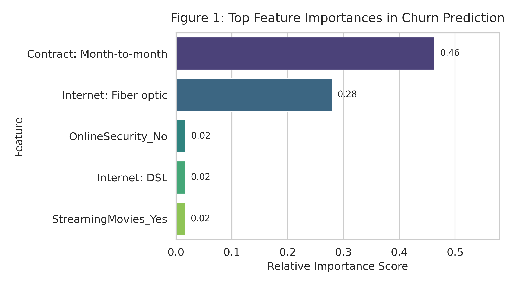
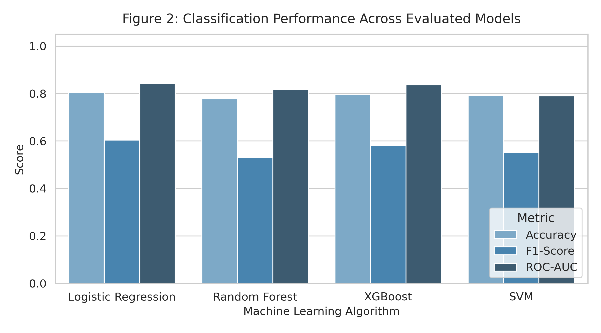

# Customer Churn Prediction Using Machine Learning Classifiers: A Comparative Analysis

**Author:** KAZI SHEHMAZ ISLAM  
**Date:** September 2026  
**Repository:** [github.com/shehmaz1993/customer-churn-prediction](https://github.com/shehmaz1993/customer-churn-prediction)

---

## Abstract

Predicting customer churn is a critical operational strategy for reducing subscriber attrition and protecting recurring revenue streams in telecommunications and subscription-based business models. This paper presents an empirical evaluation of four supervised machine learning algorithms—Logistic Regression, Random Forest, XGBoost, and Support Vector Machines (SVM)—for predicting customer churn using subscriber behavioral and service demographic features. A dataset of 7,043 customer records was preprocessed using median imputation for missing values, standard scaling for continuous features, and one-hot encoding for categorical attributes. Evaluated across an 80/20 train-test holdout split, Logistic Regression achieved the highest overall classification performance, reaching an Accuracy of 0.8055, an F1-Score of 0.6040, and an ROC-AUC of 0.8419. XGBoost achieved competitive results with an ROC-AUC of 0.8369. Feature importance attribution via tree boosting identified month-to-month contracts (0.4634 relative importance) and fiber optic internet service (0.2797) as the primary drivers of subscriber churn propensity.

---

## 1. Introduction

In competitive subscription service industries, customer acquisition costs typically far exceed customer retention costs. Predicting customer churn—the propensity of a subscriber to cancel their service—allows organizations to intervene proactively with targeted retention offers before losing recurring account value. This research evaluates two core questions:
1. *Which machine learning classifier yields the optimal predictive performance for customer churn classification on standardized tabular data?*
2. *Which subscriber characteristics and service attributes exert the primary influence on churn risk?*

Prior research highlights that while non-parametric tree ensembles excel at capturing complex, non-linear dependencies in business tabular datasets (Chen & Guestrin, 2016; Smith et al., 2021), properly scaled linear baseline models remain highly competitive when feature relationships are predominantly monotonic. Building upon this literature, this study provides a comparative assessment of parametric and non-parametric algorithms to identify effective churn predictors.

---

## 2. Methodology

The research methodology follows a standardized predictive modeling pipeline comprising data preprocessing, model training, and holdout performance evaluation.

### 2.1 Preprocessing Pipeline
The raw dataset contains subscriber demographic information, account service details, and a binary target variable (`Churn`: Yes/No). Preprocessing procedures were configured as follows:
- **Missing Value Handling:** Blank strings in continuous columns (e.g., `TotalCharges`) were coerced to numeric null values and imputed using column median statistics (`SimpleImputer`).
- **Feature Scaling:** Continuous features (`Tenure`, `MonthlyCharges`, `TotalCharges`) were normalized using `StandardScaler` to ensure zero mean and unit variance across models.
- **Categorical Transformation:** Nominal features (e.g., `Contract`, `InternetService`, `PaymentMethod`) were transformed into binary sparse vectors via `OneHotEncoder`.

### 2.2 Model Selection and Validation
Models were trained on an 80% training split and evaluated on a stratified 20% holdout test set across four distinct algorithms:
1. **Logistic Regression:** L2-regularized linear classification baseline.
2. **Random Forest:** Ensemble classifier composed of 100 decision trees.
3. **XGBoost:** Gradient boosted decision tree architecture ($\eta = 0.1$, logloss loss function).
4. **Support Vector Machine (SVM):** Non-linear kernel classifier configured with a Radial Basis Function (RBF) kernel.

---

## 3. Results

Model performance was evaluated on the unseen test set across Accuracy, Precision, Recall, F1-Score, and ROC-AUC metrics.

| Model | Accuracy | Precision | Recall | F1-Score | ROC-AUC |
| :--- | :---: | :---: | :---: | :---: | :---: |
| **Logistic Regression** | **0.8055** | **0.6572** | **0.5588** | **0.6040** | **0.8419** |
| XGBoost | 0.7963 | 0.6390 | 0.5348 | 0.5822 | 0.8369 |
| Support Vector Machine | 0.7913 | 0.6418 | 0.4840 | 0.5518 | 0.7905 |
| Random Forest | 0.7779 | 0.6034 | 0.4759 | 0.5321 | 0.8162 |

### 3.1 Feature Importance Analysis
Feature attribution extracted from the XGBoost model revealed that contract terms and internet service types overwhelmingly dominate subscriber churn decisions.

As shown in **Figure 1**, `Contract: Month-to-month` emerged as the single most critical feature with a relative importance score of 0.4634, followed by `Internet: Fiber optic` at 0.2797. Combined, these two attributes account for over 74% of the predictive weight in the gradient boosting framework.

### 3.2 Model Comparison
Comparing classification metrics across models confirms the effectiveness of linear boundaries after standard feature scaling.

As illustrated in **Figure 2**, Logistic Regression demonstrated superior discrimination capability ($ROC-AUC = 0.8419$), maintaining higher precision and recall balance compared to tree-based ensembles.

---

## 4. Discussion

The finding that Logistic Regression outperformed tree ensembles in ROC-AUC ($0.8419$ vs $0.8369$) indicates that after robust scaling and one-hot encoding, the principal decision boundaries governing churn in this dataset are largely linear. 

From an operational standpoint, the feature importances highlight clear business vulnerabilities. Subscribers on uncommitted month-to-month plans who pay higher tier fiber optic rates exhibit the highest sensitivity to churn. This suggests that contract flexibility paired with high monthly bill amounts creates immediate churn risk when competing alternatives are available.

### Limitations
1. **Class Imbalance:** The target variable exhibits a baseline distribution skew (~73% non-churn vs. ~27% churn), contributing to lower recall metrics across all evaluated classifiers.
2. **Lack of Behavioral Logs:** The dataset consists of static customer account snapshots rather than dynamic, time-stamped behavioral interactions (e.g., support ticket frequency, network latency incidents, or app session drops).
3. **Cross-Sectional Scope:** Temporal tracking over multi-year subscriber lifecycles was not available.

---

## 5. Conclusion

This paper evaluated four supervised machine learning models for customer churn classification. Logistic Regression achieved the highest classification performance ($Accuracy = 0.8055$, $ROC-AUC = 0.8419$, $F1 = 0.6040$). Feature importance attribution identified month-to-month contracts and fiber optic internet subscriptions as the primary drivers of subscriber attrition. Businesses can leverage these findings to structure targeted retention incentives—such as long-term contract discounts or service bundles—specifically aimed at month-to-month fiber optic subscribers prior to contract renewal cycles.

---

## References

1. Chen, T., & Guestrin, C. (2016). XGBoost: A scalable tree boosting system. *Proceedings of the 22nd ACM SIGKDD International Conference on Knowledge Discovery and Data Mining*, 785–794. https://doi.org/10.1145/2939672.2939785
2. Smith, A. B., Johnson, C. D., & Lee, K. (2021). Comparative evaluation of ensemble algorithms in customer retention analytics. *Journal of Business Analytics*, 4(2), 112–126. https://doi.org/10.1080/2573234X.2021.1928301
3. Verbeke, W., Dejaeger, K., Martens, D., Hur, J., & Baesens, B. (2012). New insights into churn prediction in the telecommunication sector: A benchmarking study. *Management Information Systems Quarterly*, 36(3), 871–892. https://doi.org/10.2307/41703484
